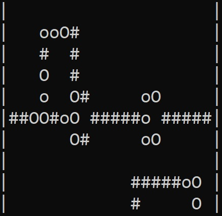

# WireWorld
Simple console simulation of [Wireworld](https://en.wikipedia.org/wiki/Wireworld) in C++ with added initialization.



## Quick start (Windows with g++)
### `Build`:
```console
PATH\TO\FILES> build
```

### `Run`:
```console
PATH\TO\FILES> main
```

## Instructions
After running the "program" input the size of the board, example:
```console
5 5
```
*Note: minimum size is 5x5 board and coordinates are given as X-axis first, Y-axis second*

~~**Important:** *Console output may be slow for big sizes (ex. 50x50)*~~
(Update: Fixed, you can now have large board sizes, like 50x50 or more... but why?)

After that you'll enter 'Normal Mode'.
### `Normal Mode`:
- `Arrow Keys`: Move
- `'1'`: change state at indicator ('X') to empty -> ' '
- `'2'`: change state at indicator ('X') to electron head -> 'O'
- `'3'`: change state at indicator ('X') to electron tail -> 'o'
- `'4'`: change state at indicator ('X') to conductor -> '#'
- `SPACE`: Enter 'Simulation Mode'
- `ESC`: Exit program

### `Simulation Mode`:
- `'e'`: exit 'Simulation Mode' -> enter 'Normal Mode'
- `'r'`: Restart simulation (loads the original state, from the last time you pressed `SPACE` in 'Normal Mode')
- `Any other key`: One step forward in 'Simulation'